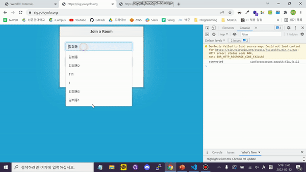

# 시그널링 - 미디어 서버 PoC

## 기술스택
- Java 11
- Springboot 2.6.2
- WebSocket, SockJS
- Kurento Media Server 6.16
- Kurento Client

---

## 작동 화면

---

## 참고
- Kurento tutorial : https://github.com/Kurento/kurento-tutorial-java
- WebRTC - 시그널링 과정 : https://andonekwon.tistory.com/71
- 시그널링 서버 만들기 : https://withseungryu.tistory.com/130
- kurento 설명 : https://gh402.tistory.com/43
- kurento window 환경에서 실행 : https://gh402.tistory.com/44?category=935378

## 관련 자료
- [WebRTC를 선택한 이유](https://github.com/stove-smooth/sgs-smooth/wiki/WebRTC%EB%A5%BC-%EC%84%A0%ED%83%9D%ED%95%9C-%EC%9D%B4%EC%9C%A0)
- [WebRTC 기반 서비스를 지원하기 위한 서버의 종류](https://github.com/stove-smooth/sgs-smooth/wiki/WebRTC-%EA%B8%B0%EB%B0%98-%EC%84%9C%EB%B9%84%EC%8A%A4%EB%A5%BC-%EC%A7%80%EC%9B%90%ED%95%98%EA%B8%B0-%EC%9C%84%ED%95%9C-%EC%84%9C%EB%B2%84%EC%9D%98-%EC%A2%85%EB%A5%98)
- [미디어 서버 선택하기](https://github.com/stove-smooth/sgs-smooth/wiki/%EB%AF%B8%EB%94%94%EC%96%B4-%EC%84%9C%EB%B2%84-%EC%84%A0%ED%83%9D%ED%95%98%EA%B8%B0)
- [Kurento 설치 및 설정](https://github.com/stove-smooth/sgs-smooth/tree/develop/docs/reference/kurento)
- Chrome에서 WebRTC 스트림 값 확인 : chrome://webrtc-internals/
- [remote stream 오디오 레벨 확인](https://github.com/stove-smooth/signaling/wiki/Remote-stream-%EC%98%A4%EB%94%94%EC%98%A4-%EC%82%AC%EC%9D%B4%EC%A6%88-%ED%99%95%EC%9D%B8)
